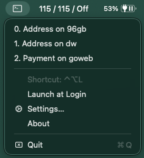
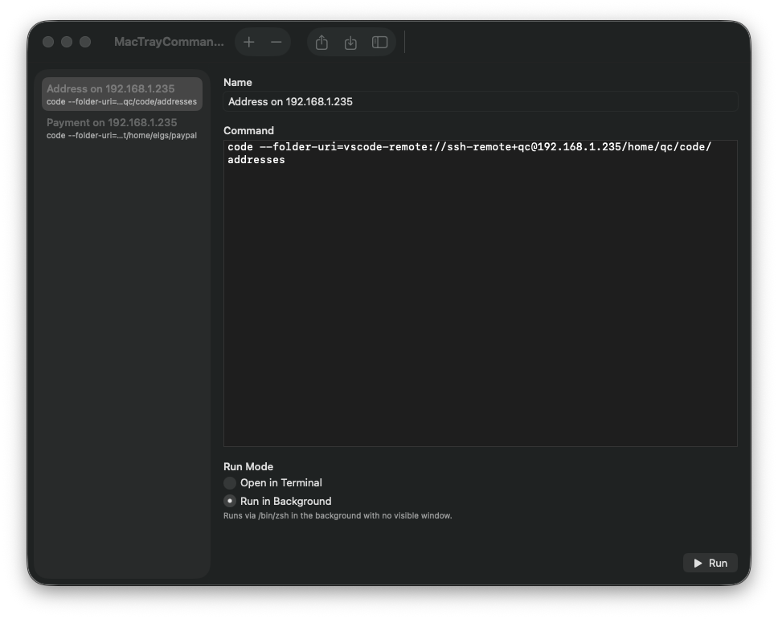

<p align="center">
  
</p>

<h1 align="center">Mac Tray Commands</h1>

<p align="center">
  A lightweight macOS menu bar app for running custom shell commands.
</p>

<p align="center">
  
  
  <a href="https://github.com/elgs/mac-tray-commands/releases/latest"></a>
</p>

---

## Features

- **Menu bar access** — click the icon to see your commands, no Dock clutter
- **Global shortcut** — press `⌃⌥L` (Ctrl+Opt+L) to open the menu from anywhere
- **Two run modes** — open in Terminal (window stays open) or run silently in background
- **Settings UI** — add, edit, and remove commands with a native SwiftUI interface
- **Launch at Login** — toggle from the menu
- **Signed and notarized** — no Gatekeeper warnings
- **Import/Export** — share or back up your commands as JSON
- **Persistent config** — commands saved to `~/Library/Application Support/MacTrayCommands/commands.json`

## Install

### Homebrew

```bash
brew tap elgs/taps
brew install --cask mac-tray-commands
```

### Manual

Download the latest `.dmg` from [Releases](https://github.com/elgs/mac-tray-commands/releases), open it, and drag the app to `/Applications`.

### Build from source

```bash
git clone https://github.com/elgs/mac-tray-commands.git
cd mac-tray-commands
xcodebuild -scheme MacTrayCommands -configuration Release build CONFIGURATION_BUILD_DIR=build
cp -R build/MacTrayCommands.app /Applications/
```

## Screenshots

### Menu Bar Dropdown
Click the terminal icon in the menu bar or press **⌃⌥L** to see your commands. Each command is numbered for easy reference.

<p align="center">
  
</p>

### Settings
Add, edit, and remove commands. Choose between running in Terminal or silently in the background.

<p align="center">
  
</p>

## Usage

1. Launch the app — a terminal icon appears in your menu bar
2. Click it or press **⌃⌥L** to see your commands
3. Click **Settings…** to add, edit, or remove commands
4. Each command has a **name**, a **shell command**, and a **run mode**:
   - **Open in Terminal** — runs in Terminal.app, window stays open when done
   - **Run in Background** — runs silently via `/bin/zsh` with no visible window

## License

MIT
