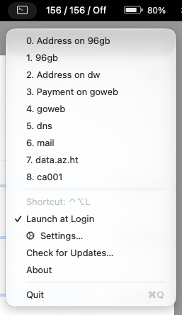
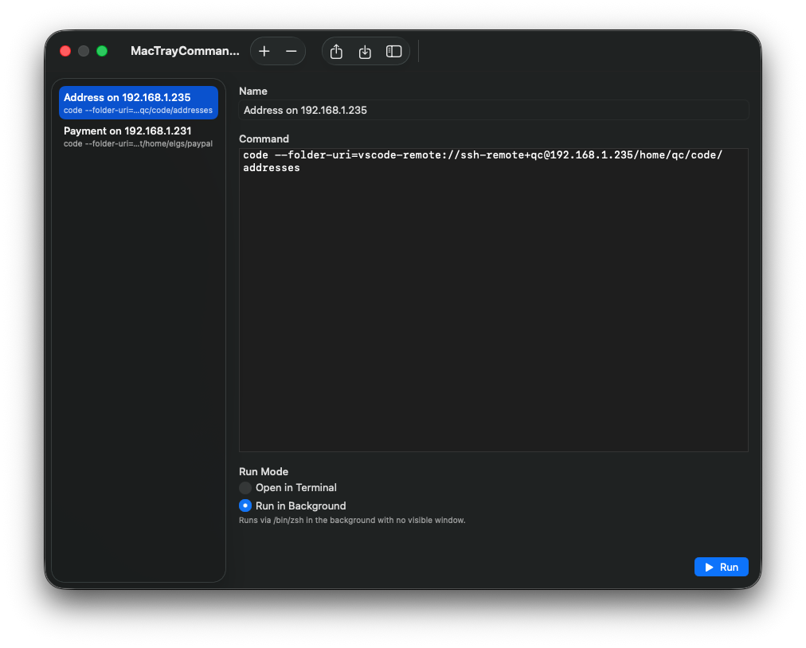

<p align="center">
  
</p>

<h1 align="center">Mac Tray Commands</h1>

<p align="center">
  A lightweight macOS menu bar app for running custom shell commands.
</p>

<p align="center">
  
  
  
  <a href="https://github.com/elgs/mac-tray-commands/releases/latest"></a>
</p>

---

## Features

- **Menu bar access** — click the icon to see your commands, no Dock clutter
- **Global shortcut** — press `⌃⌥L` (Ctrl+Opt+L) to open the menu from anywhere
- **Two run modes** — open in Terminal (window stays open) or run silently in background
- **Settings UI** — add, edit, and remove commands with a native SwiftUI interface
- **Launch at Login** — toggle from the menu
- **In-app updates** — checks the Homebrew cask for new versions about once a day; a blue dot on the menu bar icon signals a pending update, and **Update to X** in the menu downloads, verifies, installs, and relaunches
- **Signed and notarized** — no Gatekeeper warnings
- **Import/Export** — share or back up your commands as JSON
- **Persistent config** — commands saved to `~/Library/Application Support/MacTrayCommands/commands.json`

## Install

### Homebrew

```bash
brew tap elgs/taps
brew install --cask mac-tray-commands
```

### Manual

Download the latest `.dmg` from [Releases](https://github.com/elgs/mac-tray-commands/releases), open it, and drag the app to `/Applications`.

### Build from source

```bash
git clone https://github.com/elgs/mac-tray-commands.git
cd mac-tray-commands
xcodebuild -scheme MacTrayCommands -configuration Release -destination 'platform=macOS,arch=arm64' build CONFIGURATION_BUILD_DIR=build
cp -R build/MacTrayCommands.app /Applications/
```

## Screenshots

### Menu Bar Dropdown
Click the terminal icon in the menu bar or press **⌃⌥L** to see your commands. Each command is numbered for easy reference.

<p align="center">
  
</p>

### Settings
Add, edit, and remove commands. Choose between running in Terminal or silently in the background.

<p align="center">
  
</p>

## Usage

1. Launch the app — a terminal icon appears in your menu bar
2. Click it or press **⌃⌥L** to see your commands
3. Click **Settings…** to add, edit, or remove commands
4. Each command has a **name**, a **shell command**, and a **run mode**:
   - **Open in Terminal** — runs in Terminal.app, window stays open when done
   - **Run in Background** — runs silently via `/bin/zsh` with no visible window
5. **Check for Updates…** asks the Homebrew tap for a newer version right away and reports the answer

## Updates

The app checks the Homebrew cask for a newer version a minute after launch and about once a day after that. When one is found, the menu bar icon gains a small blue badge dot (hover for the version) and the menu shows an **Update to X…** item. Clicking it:

1. Downloads the release DMG from GitHub Releases. A small progress window shows the download with a **Cancel** button, then "Verifying and installing…"; the menu shows the same progress and a **Cancel Download** item.
2. Verifies the download: the SHA-256 must match the cask, the code signature must be intact, the Team ID must match the running app, and the macOS the new bundle asks for (`LSMinimumSystemVersion`) must not be newer than the one this Mac runs.
3. Swaps the new bundle into place (one atomic exchange; volumes without swap support fall back to two renames) and relaunches.

The automatic check is silent: a flaky network never produces a dialog. **Check for Updates…** in the menu runs the same check right away and answers with an alert, whichever way it goes, and an update found that way can be installed from the alert.

If any step fails (for example, the install location isn't writable), an alert says why and nothing is changed; `brew upgrade --cask mac-tray-commands` always works as a fallback. Updating in-app leaves Homebrew's recorded version behind until the next `brew upgrade`, which harmlessly reinstalls the current release.

A release is offered only to a Mac that can run it. The cask's `depends_on macos:` line names the oldest macOS a release supports; when this Mac runs something older, no update is offered and the installed version stays, and a clicked **Check for Updates…** says which macOS the release needs. The downloaded bundle's own minimum is checked again before anything is installed, so a working copy is never replaced by an app macOS will not open.

## License

MIT
